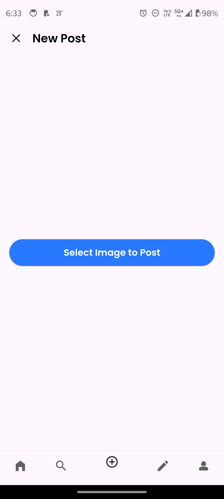

# Instagram Clone App

The Instagram Clone App is a mobile application built with Flutter that mimics the core functionalities of Instagram. It leverages Firebase for backend services, allowing users to perform CRUD operations such as creating, reading, updating, and deleting posts. The app includes features like user authentication (login and signup), post uploading, exploring posts, editing user profiles, interacting with other users' content (like, comment, delete), and more.

## Features

- **User Authentication**: 
  - Sign up and log in with email and password.
  - User data is securely stored in Firebase Authentication and Firestore.
  
- **Post Management**:
  - Upload images as posts with captions.
  - View posts on the home screen, which displays content from other users.
  - Like and comment on posts.
  - Delete posts if needed.

- **Explore Screen**:
  - Browse random posts from other users.
  - Discover new content outside your following list.

- **Profile Management**:
  - View your profile with details such as bio, profile picture, and all your posts.
  - Edit profile details, including username, bio, and profile picture.

- **Post Interactions**:
  - Like or unlike posts.
  - Comment on posts to engage with other users.
  
## Screenshots

<table>
  <tr>
    <td style="text-align: center;">
      <strong>✨ Login Screen</strong><br>
      
    </td>
    <td style="text-align: center;">
      <strong>✨ Signup Screen</strong><br>
      
    </td>
    <td style="text-align: center;">
      <strong>✨ Home Screen</strong><br>
      
    </td>
    <td style="text-align: center;">
      <strong>✨ Explore Screen</strong><br>
      
    </td>
  </tr>
  <tr>
    <td style="text-align: center;">
      <strong>✨ Profile Screen</strong><br>
      
    </td>
    <td style="text-align: center;">
      <strong>✨ Edit Profile Screen</strong><br>
      
    </td>
    <td style="text-align: center;">
      <strong>✨ Upload Post Screen</strong><br>
      
    </td>
    <td style="text-align: center;">
      <strong>✨ Post Details Screen</strong><br>
      
    </td>
  </tr>
  <tr>
    <td style="text-align: center;">
      <strong>✨ Post Interaction Screen</strong><br>
      
    </td>
    <td style="text-align: center;">
      <strong>✨ Delete Post Confirmation</strong><br>
      
    </td>
  </tr>
</table>

## How to Use

1. **Starting the App**:
   - Upon launching, users can either log in if they have an account or sign up to create a new one.

2. **Home Screen**:
   - View posts from other users.
   - Interact with posts by liking or commenting.

3. **Explore Screen**:
   - Discover new posts from users not in your follow list.
   
4. **Profile Screen**:
   - View your posts, profile picture, bio, and other details.
   - Edit your profile by tapping the 'Edit Profile' button.

5. **Uploading a Post**:
   - Tap the '+' icon to upload a new post.
   - Select an image, add a caption, and share it with others.

6. **Editing Profile**:
   - Navigate to the profile screen and tap 'Edit Profile' to change your username, bio, or profile picture.

7. **Post Management**:
   - Tap on your posts to edit or delete them.

## Installation

To run the Instagram Clone App on your local machine, follow these steps:

1. Clone the repository:
   ```bash
   git clone https://github.com/jagritixjha/instagram-clone-app.git
